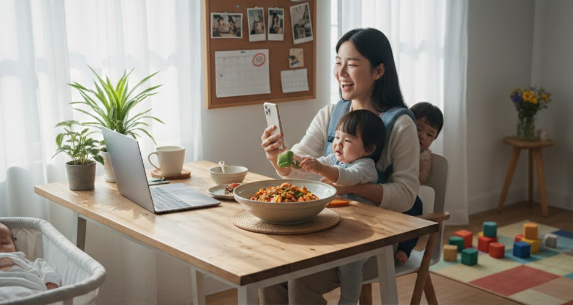
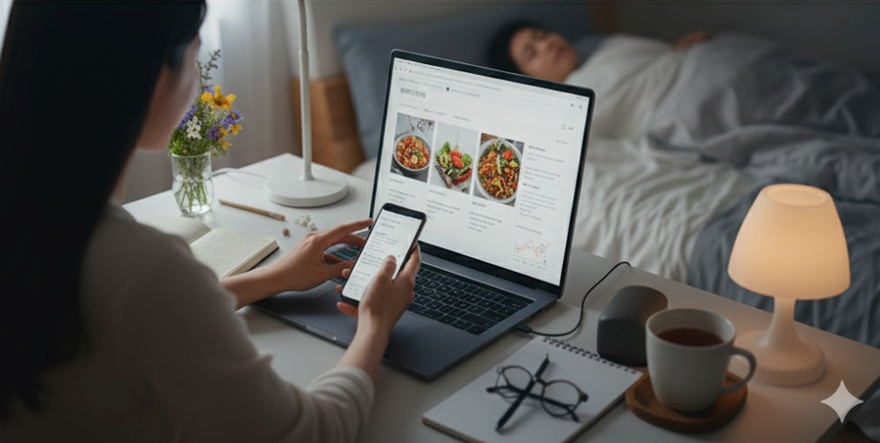

요즘 일상 이야기나 살림 팁, 육아 경험을 공유하는 주부 블로그를 보면서  
“나도 한 번 해볼까?” 고민해본 분들 많으실 거예요.

하지만 막상 시작하려고 하면  
무엇부터 해야 할지,  
정말 나도 할 수 있는지  
헷갈리는 게 사실이죠.

이 글에서는  
✔ 주부가 블로그를 시작하면 좋은 이유  
✔ 블로그 주제 정하는 방법  
✔ 블로그 시작 순서  
✔ 부수입으로 연결하는 방법  
✔ 꼭 알아야 할 주의사항  
까지 **처음 시작하는 분 기준으로** 하나씩 정리해볼게요.

---

## 주부가 블로그를 시작하면 좋은 이유 3가지

### 1. 내 이야기를 기록하고 공유할 수 있어요
블로그는 누군가의 기준에 맞출 필요 없이  
**내가 주인공이 되는 공간**이에요.

육아 이야기, 살림 노하우, 맛집 후기,  
직접 써보고 좋았던 제품까지  
일상의 경험을 글과 사진으로 자유롭게 남길 수 있어요.

댓글이나 공감을 통해  
비슷한 상황의 주부들과 소통할 수 있다는 것도 큰 장점이에요.

---

### 2. 육아·가사 사이 스스로 조절하며 할 수 있어요
블로그에는 마감도 없고,  
정해진 출근 시간도 없어요.

아이 낮잠 시간,  
집안일 끝난 후 짧은 시간,  
잠들기 전 30분처럼  
**내 생활에 맞춰서** 조금씩 써도 됩니다.

---

### 3. 소소한 부수입으로 이어질 수 있어요
블로그는 단순 기록을 넘어  
광고나 제휴를 통해 **부수입**으로 이어질 수 있어요.

처음부터 큰 수익을 기대하기보다는  
“일상 기록 → 정보 공유 → 신뢰 → 수익”  
이런 흐름으로 생각하면 부담이 적어요.

---

## 블로그 주제, 처음에 이렇게 정해보세요

### ✔ 잡다한 이야기(일상형 블로그)
- 육아 + 살림 + 쇼핑 + 일기
- 부담 없이 시작 가능
- 대신 방향성이 없으면 성장 속도는 느릴 수 있어요

### ✔ 주제를 정한 블로그(특화형)
- 예: 육아, 절약, 정리정돈, 살림 노하우
- 경험을 정리할수록 신뢰도 상승
- 장기적으로 수익화에 유리

👉 처음이라면  
**“일상 + 중심 주제 1개”** 정도로 시작하는 걸 추천해요.

---

## 블로그 시작 방법 (초보자 기준)

### STEP 1. 준비물
- 스마트폰 또는 PC
- 인터넷 환경

처음부터 장비에 돈 쓸 필요는 없어요.  
스마트폰만 있어도 충분히 시작 가능합니다.

---

### STEP 2. 블로그 개설
블로그는 크게 두 종류예요.

**무료 블로그**
- 시작이 쉽고 부담 없음
- 디자인/기능 제한이 있음

**유료 블로그(워드프레스 등)**
- 자유도 높음
- 비용·설정 난이도 있음

👉 처음 시작하는 주부라면  
**무료 블로그로 연습 → 익숙해지면 확장**이 가장 무난해요.

---

### STEP 3. 글 쓰기
첫 글부터 잘 쓰려고 애쓰지 않아도 괜찮아요.

- 하루 일상
- 오늘 느낀 점
- 내가 직접 겪은 경험

이런 것부터 편하게 써보세요. 글은 **쓰면서 늘어요.**

---

## 주부 블로그로 수익을 만드는 구조

블로그 수익은 대부분 **광고 수익**에서 나와요.

### 대표적인 방식
- 광고 클릭형
- 노출형
- 구매 발생 시 수익 발생(제휴/어필리에이트)
- 일정 기간 광고 게재 수익

공통점은  
👉 **방문자가 늘수록 기회도 늘어난다**는 것.

---

## 읽히는 주부 블로그 만드는 팁

### 1. 내가 잘 아는 이야기 쓰기
억지로 유행 따라가면 오래 못 가요.  
**내가 직접 겪은 이야기**가 제일 강력해요.

---

### 2. 독자 입장에서 쓰기
- 문단 나누기
- 사진 활용
- 어려운 말 줄이기

“이 글을 처음 보는 사람이 이해할까?”  
한 번만 생각해보세요.

---

### 3. SNS와 함께 활용하기
블로그만으로는 초반 유입이 적을 수 있어요.  
SNS에 글 링크를 공유하면 도움이 됩니다.

---

### 4. 기본적인 SEO 신경 쓰기
- 제목에 핵심 키워드 넣기
- 소제목 활용
- 질문에 답하는 글 구성

이것만 지켜도 검색 유입에 도움이 돼요.

---

## 주부가 블로그를 오래 하려면

### ✔ 생활이 먼저
아이, 가족, 내 컨디션이 우선이에요.  
블로그 때문에 스트레스 받으면 오래 못 가요.

### ✔ 처음부터 큰 수익 목표 ❌
처음엔 기록이 목적이면 충분해요.  
수익은 나중에 따라옵니다.

### ✔ 남과 비교하지 않기
각자 상황과 속도가 달라요.  
어제의 나보다 한 줄이라도 쓰면 충분해요.

---

## 블로그 운영 시 주의사항

### 1. 개인정보 조심
- 아이 이름, 학교
- 집 위치 노출
- 실명 노출

사진 배경도 꼭 확인하세요.

---

### 2. 법적인 표현 주의
- 남의 사진 무단 사용 ❌
- 과장·허위 표현 ❌
- 광고성 글은 표시 필요

특히 건강·화장품 관련 글은  
표현을 조심하는 게 좋아요.

---

## 마무리
주부 블로그는  
✔ 특별한 재능이 없어도  
✔ 지금의 생활을 그대로 활용해서  
시작할 수 있는 기록 공간이에요.

완벽하게 시작하려고 미루기보다  
**오늘 한 편 써보는 것**이 가장 중요해요.

작은 기록이 쌓이면  
나만의 자산이 됩니다.